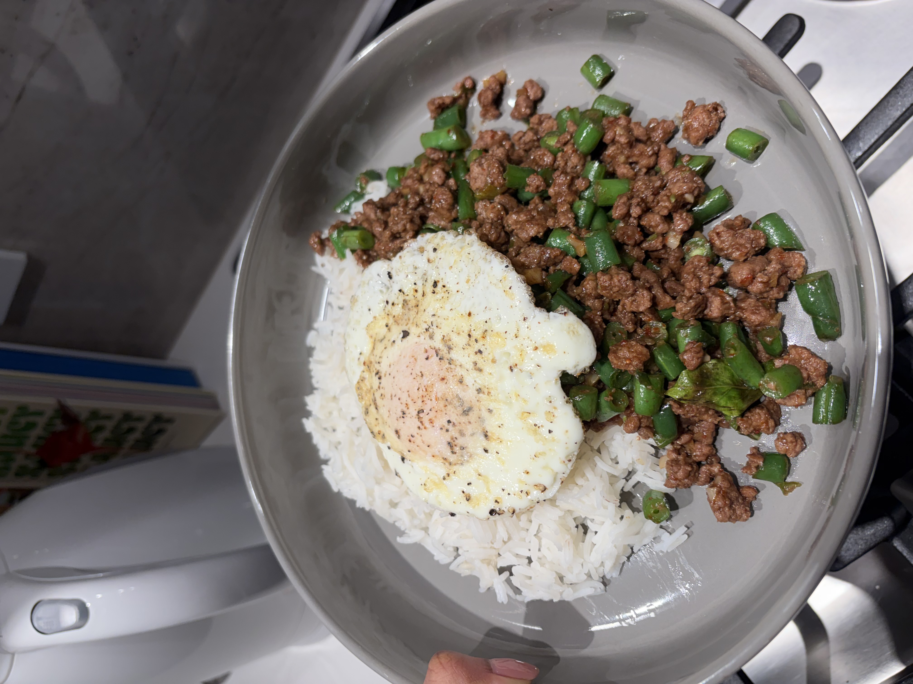

+++
title = "Beef Pad Kra Pow"
date = 2026-01-29
description = ""
+++

A quick note from the namesake of this blog:

"It has come to my attention that this sweet, love letter of a website has made its rounds to many others over the last week so I feel I should say a few words from my own pov:

Firstly, I am so, loosely eyeballing everything when I cook and provide these recipes. I used to tell my mom I couldn’t learn how to cook from her because she doesn’t use measurements……. Oops. With that, moving forward I’ll do my best to be very precise in the case that anyone actually wants to make these at home (I’m blushing).

Second, I get all my recipes from Instagram and TikTok. I really appreciate how short form video has made cooking so approachable and I love finding new foods to make. I’m not “re-inventing the wheel” #corporatejargon but maybe soon I’ll feel inspired enough to come up with my own dishes.

And lastly, every recipe that I make can be veg or non-veg. My greatest challenge in this whole process has been finding dishes for Aashray and I that solely differ in the protein component, so we can both enjoy the same meal.

Anyways, maybe I’ll be more involved providing my voice here, but I’ll give the reigns back to Shray."

-Nive

And now for the recipe! This was banging one of the best dinner preps we've had in a while, going to be a repeat for sure in a few weeks I'll probably try to make it myself as well and see how it compares.

We really on a crazy run this week after the seahawks W and into this meal prep feels like everything is going right in life these days, on to the Patriots.

Vegas trip coming up for wedding food tasting gonna be a movie and maybe we put up some sneak peeks here?

**Ingredients (3 servings):**

- 1 lb ground beef or impossible beef
- 2 cups cut green beans
- 4-5 thai basil leaves
- 3 thai green chillis
- 3 cloves garlic

**Sauce:**

- 2-3 tbsp oyster sauce
- 1 tbsp fish sauce
- 2 tbsp soy sauce
- a splash of sesame oil and rice vinegar (optional but fun)
- 1 small spoon of sugar

**Steps:**

1. Finely dice the garlic and chillis. Optionally, if you have a mortar and pestle, you can make this into a paste.
2. Sautee garlic and chilli in a neutral oil until fragrant, add choice of ground beef.
3. Cook all the way through, then add the cut green beans.
4. Sautee for another 4-5 minutes.
5. Mix all the sauce ingredients, then add to the pan.
6. Allow another 5 minutes for sauce to combine with beef and beans.
7. Add thai basil leaves and let them fry in the pan, until fragrant.
8. Serve with white rice and a fried egg on top.