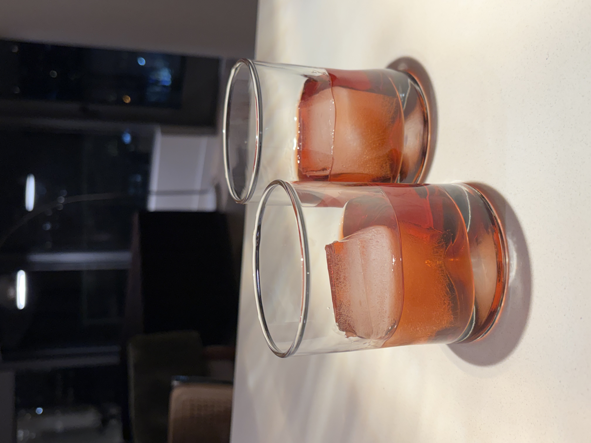
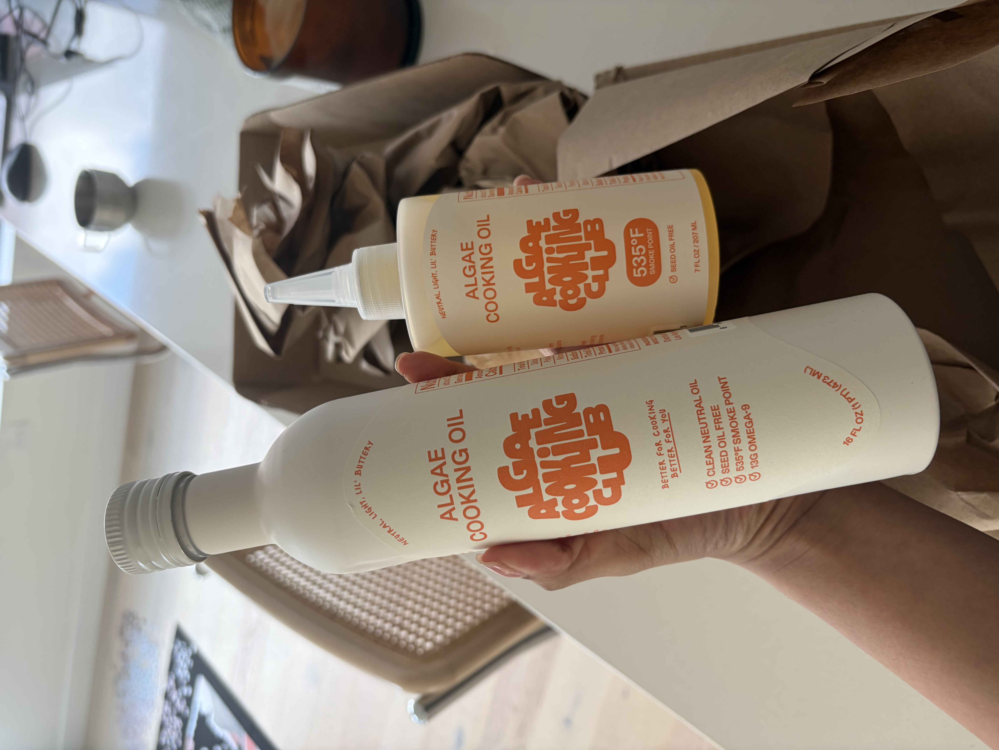
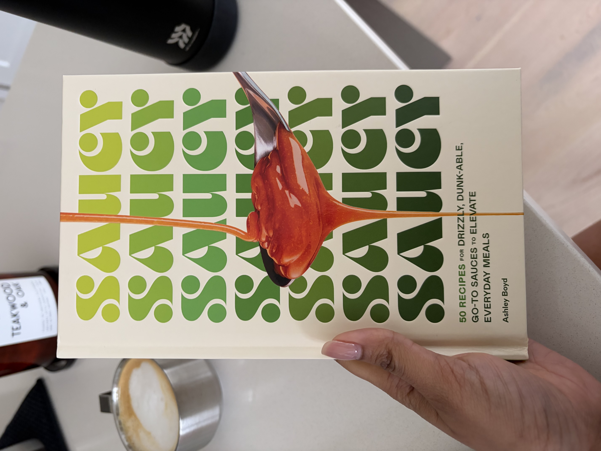

+++
title = "Negronis, Sauce and Friends"
date = 2026-01-29
description = ""
+++

No recipe today since Nive's already made this [Toasted Cauliflower Kale Pasta](@/posts/11-4-25-cauli-kale-pasta/index.md) before and Negronis are a pretty classic cocktail you can find in a million places, just a quick post cus we had a great time hosting Pavan and Anj for the week! Super good vibes felt like we were back in NY for the one time!!

Also shout out to algae oil this shit is game changing literally makes everything better and so good for high heat cooking like a quick egg, not to mention insanely healthy.

"The high smoke point of the algae oil definitely makes all the food I cook in it tend to be much better quality, its not actually the flavor of the oil itself, which is actually pretty neutral". -Nive

Thanks to Pav and Anj for this awesome sauce book too! We whipped up this fire green sauce real quick to go with some sauteed mushrooms on the side and it was really nice.

Hit me up if you want the sauce recipe it was actually so bomb.
