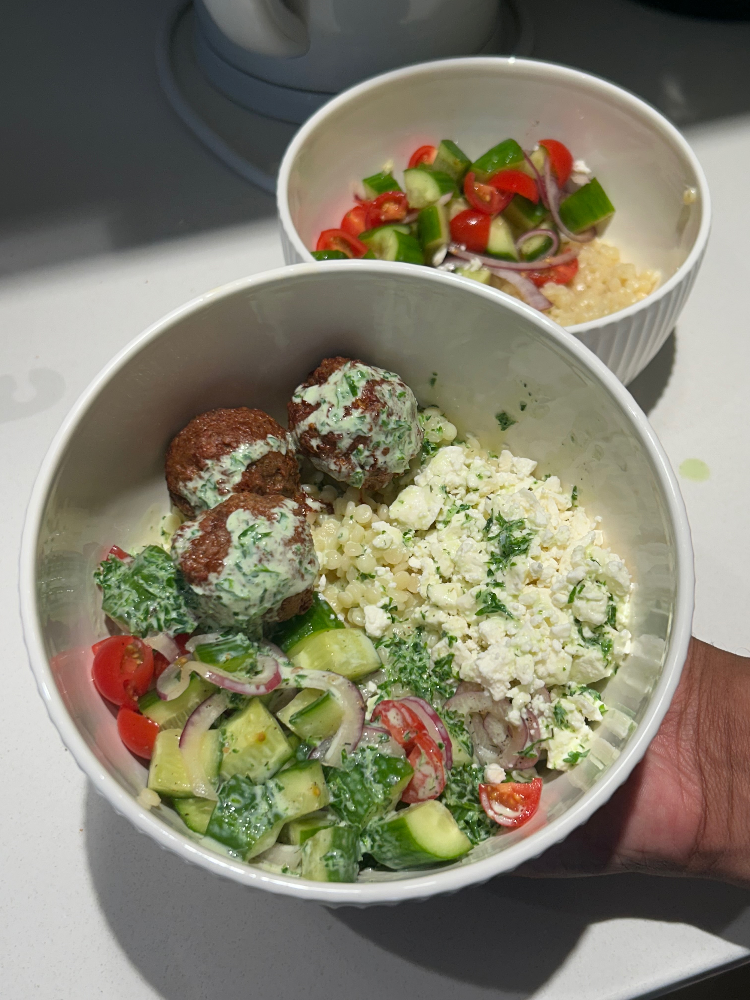

+++
title = "Cava At Home"
date = 2025-08-04
description = "Cava At Home"
+++

Nive really popped off with this, I call these "silent meals" cus the two of us will go mute and just destroy our dinner without a word.

Super quick and easy meal she lowk can make way cooler stuff but this was so good and satisfying.

**Ingredients (6 servings):**

- 16 oz couscous
- 5 persian cucumbers
- 1/4 cup red onion (julienned)
- 1 cup cherry tomatoes
- salt and pepper.
- feta cheese
- protein (we used beyond plant meatballs)

**Dressing**

- 1 cup greek yogurt
- 1/4 cup parsley
- 1/4 cup cilantro
- 2 tbsp lemon juice
- 1/4 cup dill
- salt and pepper to taste.

{{ resize_image(path="posts/08-04-25-cava-at-home/Cava_At_Home.jpeg", width=450, height=450, op="scale") }}

**Steps:**
1. Combine all dressing ingredients and blend, dilute with water if needed.
2. Add cucumber, onions and tomatoes into a mixing bowl with salt and pepper.
3. Cook couscous as instructed.
4. Prepare your preferred protein
5. Assemble and serve.