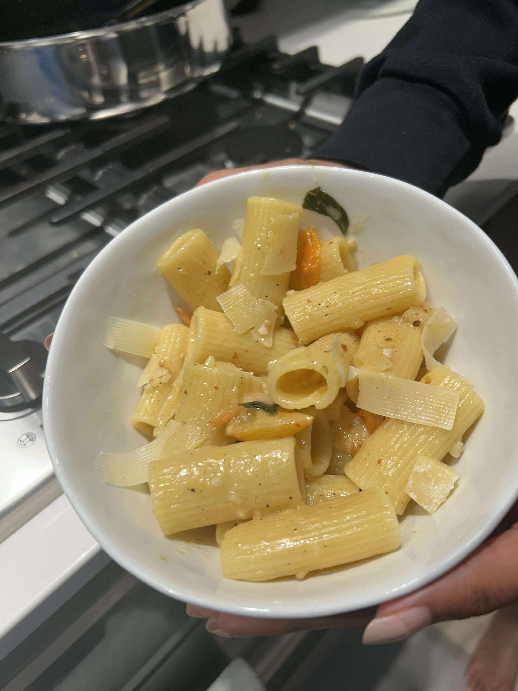
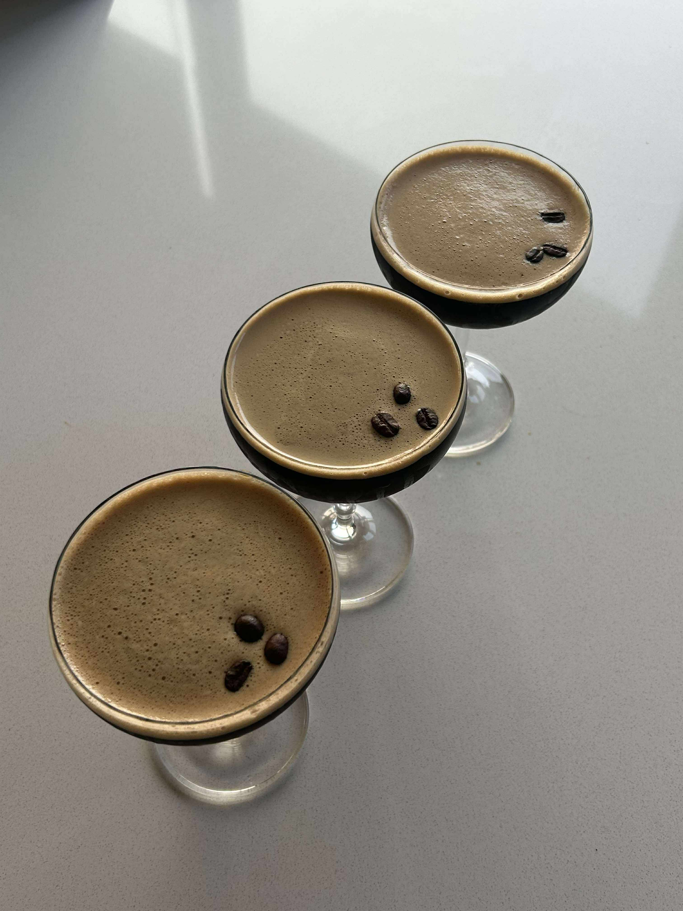

+++
title = "Sungold Rigatoni Pomodoro"
date = 2025-08-17
description = "Sungold Rigatoni Pomodoro"
+++

Super fun week with the boy Pavan staying at our place! Nive treated us to a super refreshing and tasty summer pasta with sungold tomatoes, and I made some espresso martinis for us to sip on the side.

Nive was super happy to have Pavan around and staying at our place for the first time! We got to go around the usual Seattle spots and enjoy the city like old times.

**Ingredients (2 servings):**

- 12oz sungold flavor bomb tomatoes
- 1/2 shallot, minced
- 3 cloves garlic, minced
- 16oz rigatoni
- 1/3 cup of white wine
- 1/4 cup grated parmesan
- 1/4 cup of basil
- salt and pepper, to taste
- chilli flakes

**Steps:**

1. Cook the pasta per instructions, save 1 cup of pasta water for later use.
2. In a sauce pan, sautee the shallot and garlic in olive oil, until transluscent
3. Cut tomatoes in half, add to the sauce pan and simmer unti blisted.
4. Once tomatoes have started to blister, add wine and allow alcohol to cook off for a few minutes.
5. Once the wine has finished cooking off, add the parmesan cheese to thicken the sauce.
6. Add the pasta and pasta water to the sauce pan, adjust taste with salt/pepper/chilli flakes.
7. Tear up the basi and mix in the sauce pan.
8. Leave the pasta covered and on simmer for ~5 minutes before serving.