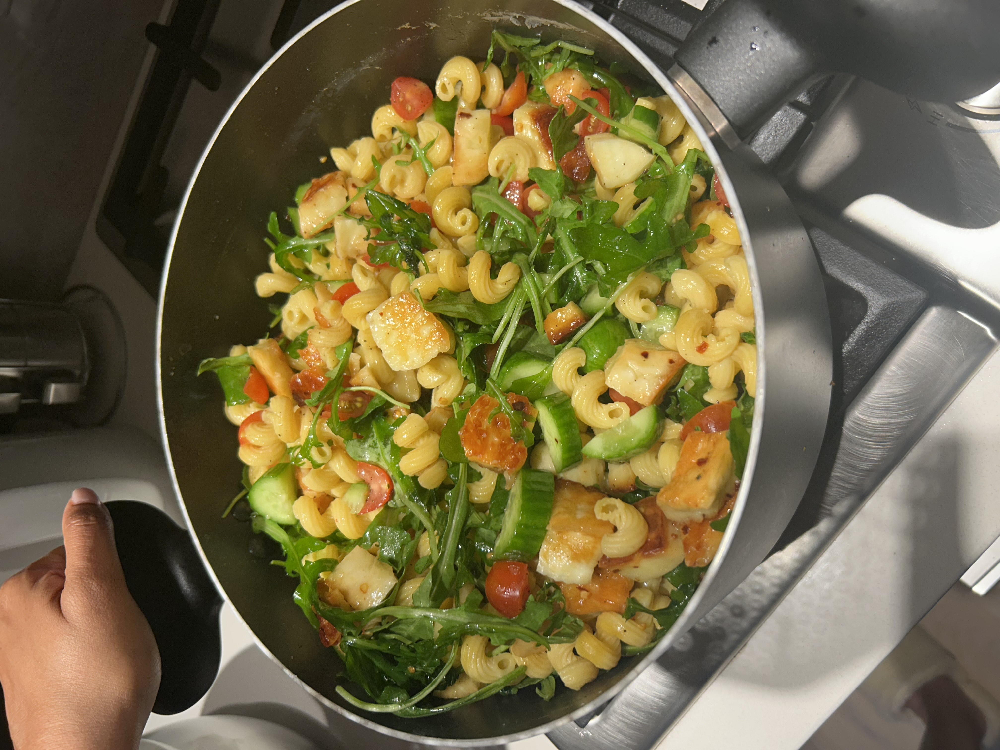

+++
title = "Halloumi Pasta Salad"
date = 2025-09-05
description = "Halloumi Pasta Salad"
+++

First post in a while since we were on vacation in Hawaii for a week and otherwise have been absolutely slammed with different things going on.

It was super nice hosting Diego for the weekend and getting out and about! We back in our day-to-day routine now and this was an awesome and pretty simple meal prep that Nive made for lunch.

**Ingredients (6 servings):**

- 16 oz pasta (we used banza protein pasta).
- 8 oz halloumi, cubed.
- 2 tbsp honey (hot honey preferably).
- 1 tbsp chili flakes.
- 1 cup grape tomatoes.
- 1 cup arugula.
- 1 medium cucumber.
- salt and pepper to taste.

**Steps:**

1. Cook the pasta as per instructions.
2. Pan sear halloumi in olive oil, add honey and chili flakes half way through, cooking until nice and golden.
3. Chop the tomatoes, arugula and cucumber, mix, and add salt and pepper to taste.
4. Add cooked pasta to salad mix.
5. Add cooked halloumi to the salad mix, along with all of the juices and olive oil from the pan, mix, and serve.
