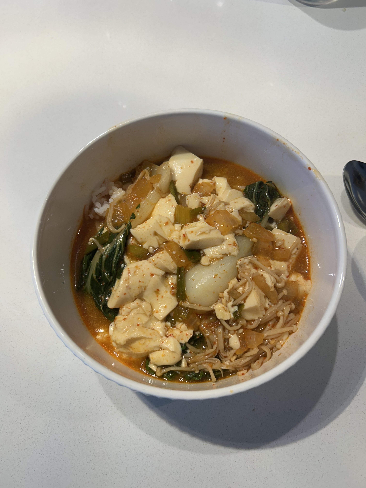

+++
title = "Soondubu - Korean Soft Tofu Soup"
date = 2025-09-09
description = "Soondubu - Korean Soft Tofu Soup"
+++

Guest recipe from Shray today. I'm off this week and wanted to prep up a meal that I knew Nive would love, which is almost always a nice hot soup. Pho is her favorite of all soups, but ramen is also a close love and soondubu too, so I decided to make soondubu this time given we already had most of the things needed at home.

**Ingredients (4 servings):**

- 32 oz Soon (soft) tofu (I went a bit heavy on the protein here, can halve this if you prefer more soup to solid).
- 2 tbsp gochugaru.
- 1 tbsp gochujang. (Skip this if you prefer a bit less spicy).
- 2 cups beef broth (anchovy broth is traditional but I prefer a beefier flavor).
- 1 bunch enoki mushroom.
- 2 cups bok choy.
- 1 white onion.
- 1 tbsp minced garlic.
- 1 shoot green onion.
- 2 tbsp olive oil.
- salt and pepper to taste.
- 1 cup rice.

**Steps:**

1. Chop the white onion and green onions, separating the white stems from the green onions.
2. Bring a pot to medium temp, add the oil and cook the white stems of the green onions for ~30 seconds, then add the remaining onion, minced garlic, salt, pepper and gochugaru, cooking for 4-5 minutes until onions are slightly translucent.
3. Add the beef broth and raise temp until broth is boiling, mix in gochujang and make sure it dissolves.
4. Once the broth is boiling, reduce the temperature to a simmer, and add the enoki mushroom and bok choy to cook for 2-3 minutes.
5. At this point, taste the broth, and add more gochugaru/salt/pepper as needed to taste. If the broth is too spicy, add some brown sugar as well.
6. Add the tofu to the pot and cook for 3-4 minutes, breaking it up into bite-sized chunks.
7. Serve with rice on the side.
