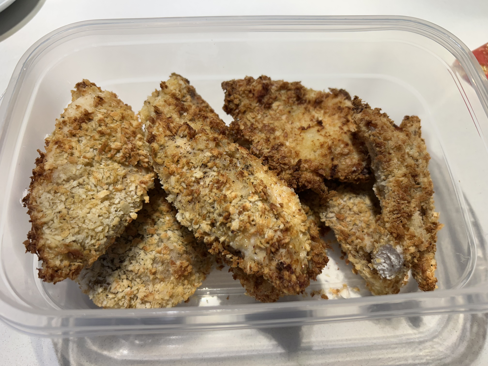

+++
title = "Air-Fried Chicken Katsu"
date = 2025-09-12
description = "Air-Fried Chicken Katsu"
+++

Another guest post from Shray but this time I wanted to treat myself to a sligthly tastier meal prep protein to go along with the soondubu and pasta salad we were eating for the week.

I tried to make Katsu but avoid deep frying or using too much oil/bread crumbs etc and I think it ends up being a decently healthy protein.

**Ingredients (2 servings):**

- 32oz chicken breast.
- 2 cups panko bread crumbs
- 2 eggs
- 1/2 cup flour.
- garlic powder.
- onion powder.
- salt and pepper to taste.

**Steps:**

1. Slice each chicken breast horizontally, and pound the meat down into ~0.5 inch thick pieces.
2. Combine the eggs, flour, garlic powder, onion powder, salt and pepper into a mixing bowl and whisk thoroughly.
3. Place the breadcrumbs across a plate.
4. One by one, thoroughly put each piece of chicken through the egg mix, and coat with breadcrumbs from the plate by flipping it and rubbing breadcrumbs onto the meat by hand.
5. In the air fryer, spray the top of the chicken with cooking oil, and cook 360 degrees for 9 minutes.
6. Flip the chicken, spray with cooking oil, and cook again for 360 degrees at 9 minutes.