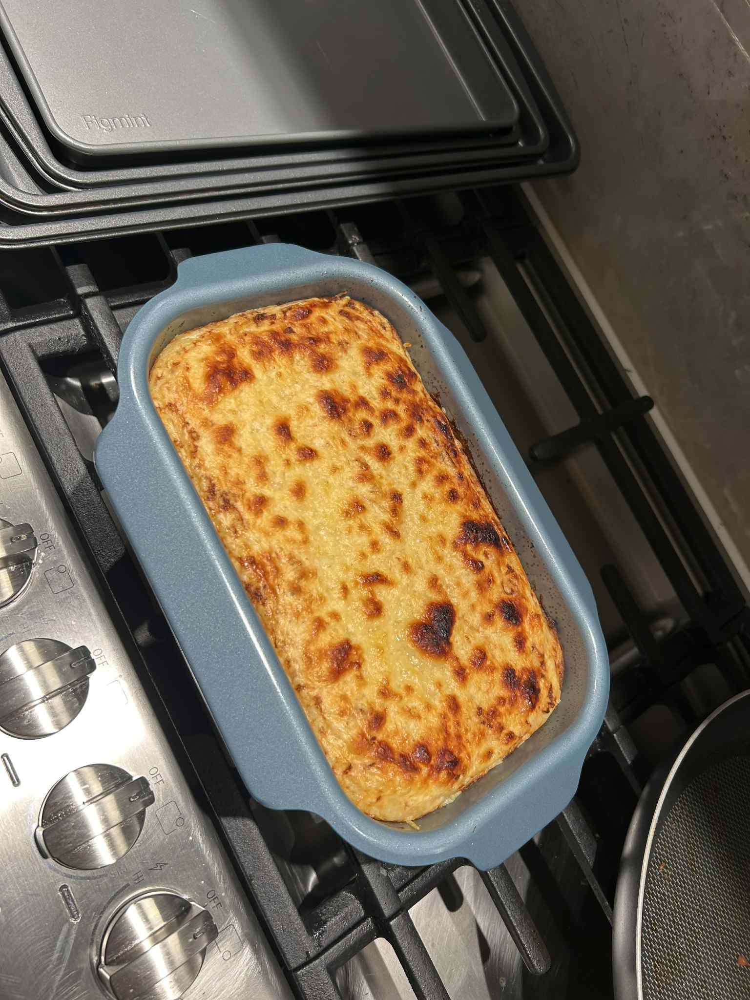
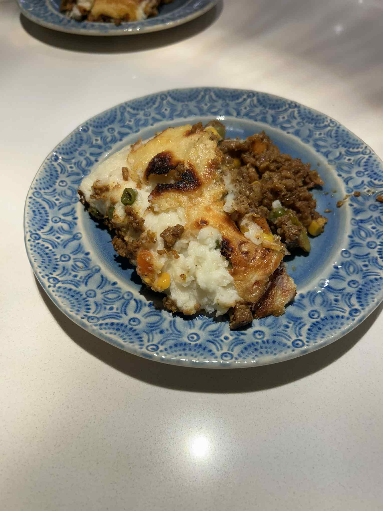

+++
title = "Shepherd's Pie"
date = 2025-09-15
description = "Shepherd's Pie"
+++

This was such a dream meal and great start to the fall of many more hearty ones. Had to pop out the fresh new blue pan for this one Nive said imma pop off for the one time.

Trying to get into running shape while also eating all her gas meals is tough sike they pretty healthy to be honest.

God bless the shepherds wherever you are keep the sheep coming.

**Ingredients (4 servings):**

- 1 lb mashed potatoes (we use ready made or microwave for this)
- 1 lb ground beef or impossible beef
- 2 cups frozen mixed vegetables (carrots and peas are a must)
- 1/2 cup white onion
- 3 cloves garlic
- 1 cup cheese for topping
- 3 tbsp tomato paste
- 1 tbsp cumin
- 1/2 tbsp oregano
- salt and pepper to taste

**Steps:**

1. Preheat the oven to 400 degrees.
2. Sautee onion and garlic with 2 tbsp oil, until onions are transluscent.
3. Mix in tomato paste, cook for 4 minutes.
4. Add ground beef and seasoning, continuing to cook until well browned.
5. Add mixed vegetables and cook until vegetables are soft, check for taste and season as needed.
6. In a greased oven pan, evenly spread out cooked mixture, then add mashed potato on top, and cover with cheese. Bake for 25 minutes.
7. For 5 minutes, broil to crispen the cheese on top. Be careful not to overcook it here.
8. Allow to cool for 5 minutes before serving.