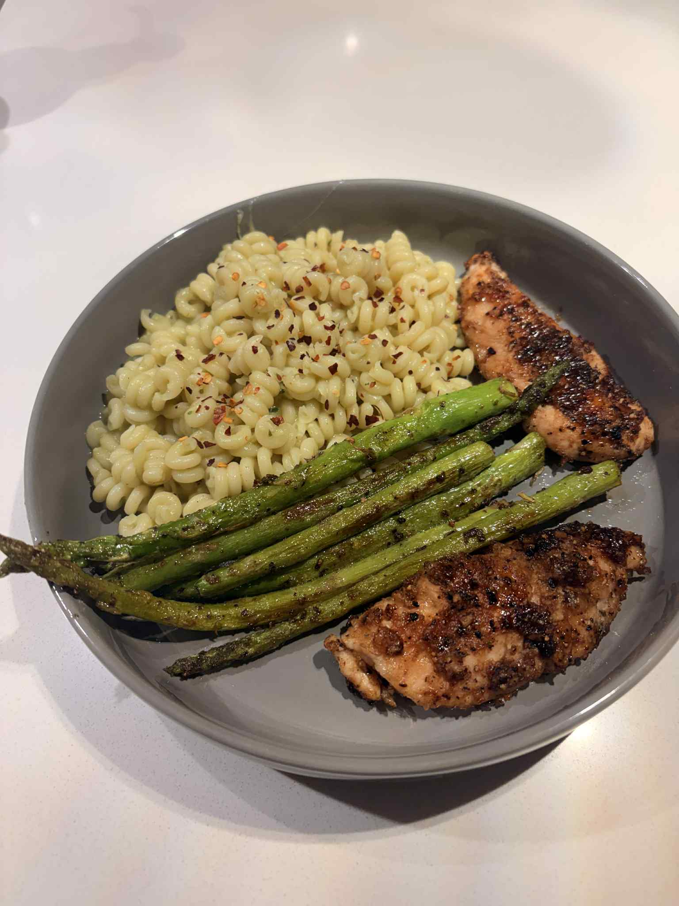

+++
title = "Avocado Pasta and Asparagus"
date = 2025-09-22
description = "Avocado Pasta and Asparagus"
+++

OK so we got a blender and honestly this was the first great meal making an interesting sauce with hahaha I'm surprised how much the avocado pasta sauce was able to taste like a lighter less fatty pesto pasta. Green goddess went off w this one shout out to you.

**Ingredients (5 servings):**

- 1 lb asparagus
- 1 lb pasta
- 1 avocado
- 1/2 cup pasta water
- 3 tsp lemon juice
- 1/2 cup parmesan
- 3 cloves minced garlic
- 1 minced shallot
- salt and pepper to taste

**Steps:**

1. Cook 1 lb pasta al dente, put aside 1 cup of water.
2. Blend avocado, lemon juice, garlic, shallots and parmesan with 1/2 cup of pasta water, adding more water as needed to achieve a liquidy sauce texture.
3. Mix in blended sauce with pasta, adjusting with salt and pepper to taste.
4. Cook asparagus to your preference and serve.
