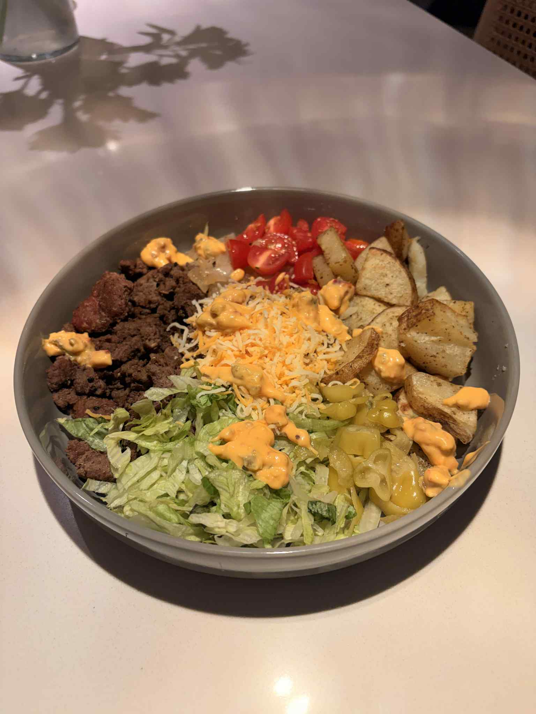
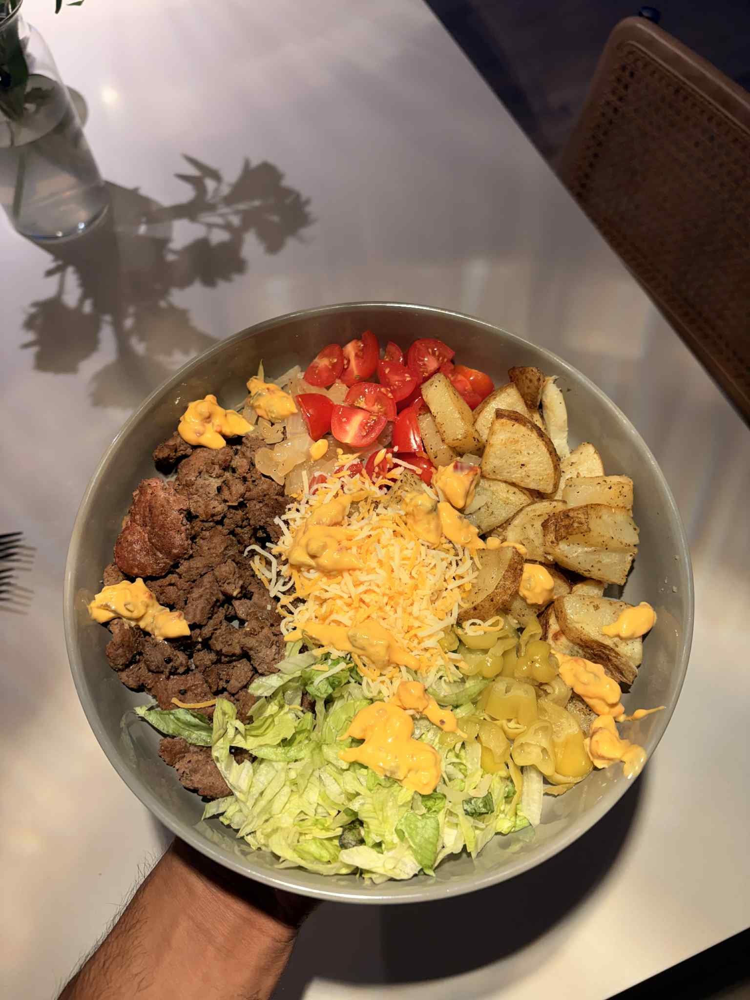

+++
title = "Hamburger Bowl"
date = 2025-09-25
description = "Hamburger Bowl"
+++

OK so this was such an enjoyable meal prep but also so insanely easy to make, and without having the usual hamburger bun and limiting the amount of cheese and oil, this was overall a fairly healthy meal prep too that we will definitely go back to a lot when tossing together the different leftovers in the fridge.

Most of the ingredients in this recipe are just to serve with the meat and potatoes, so go ahead and toss in whatever you want to as well.

**Ingredients (6 servings):**

- 8 oz roma tomatoes
- 3 yukon potatoes
- 2 cups shredded cheese
- 2 lb ground beef
- 1 lb shredded lettuce
- 8 oz pepperoncini

**Steps:**

1. Cube potatoes into 1 inch cubes, generously oil and season, and bake at 375 degrees for 40 minutes. Optionally, broil for a few minutes at the end to crispen.
2. Cook the ground beef through and season to taste.
3. Plate the potatoes and ground beef with the remaining ingredients and serve.
