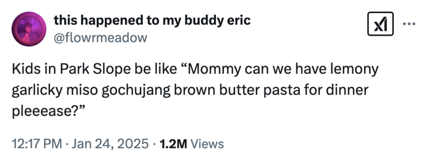
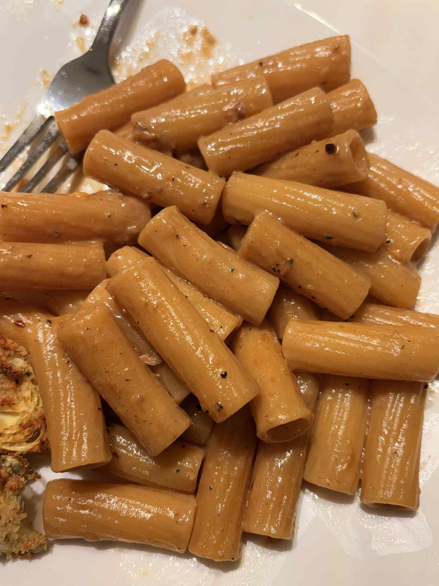

+++
title = "Miso Butter Pasta"
date = 2025-10-06
description = "Miso Butter Pasta"
+++

Alright but if this how the Park Slope kids eating then I wish I was a park slope kid omg this was so fire for no reason damn.

No lemon garlic gochujang but tbh that one will come another day with more time this was a chill frilled down version that was nice and miso-y and quick to whip up on a Monday night.

**Ingredients (4 servings):**

- 1 lb pasta
- 1/6 cup butter
- 1-2 tbsp miso paste, based on umami preference
- 2 tbsp cream (optional, adds a bit more thickness to the sauce)
- salt and pepper to taste
- 1/2 cup grated parmesan

**Steps:**

1. Cook pasta al dente as per instructions, save 1 cup of pasta water.
2. In a sauce pan on medium heat, melt down butter completely, and add miso paste.
3. Allow paste and butter to slowly combine, for up to 10 minutes.
4. Bring sauce to a simmer on low heat, add 1/2 cup of pasta water and raise back to medium heat, allowing the sauce time to thicken.
5. Add 1/2 cup of parmesan and continue to add pasta water as the sauce emulsifies.
6. Add 2 tbsp of cream, continue to simmer at medium heat for 5-10 minutes.
7. Add pasta and cook in sauce, adjusting seasoning as needed.
8. Serve with chilli flakes
