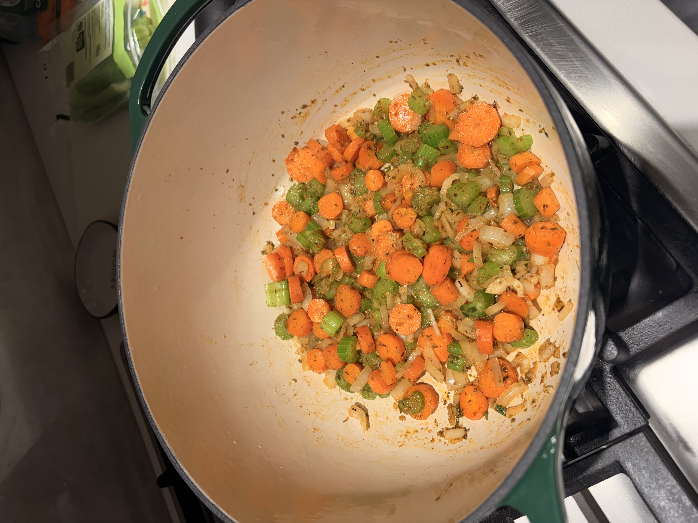
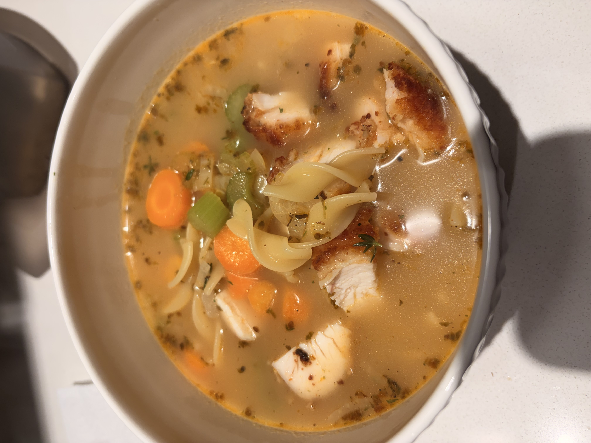

+++
title = "Chicken Noodle Soup"
date = 2025-11-21
description = ""
+++

**Ingredients:**

This recipe can be made vegetarian by excluding the grilled chicken and using veggie stock.

1. 1 white onion.
2. 5 large carrots, chopped.
3. 5 celery shoots, chopped.
4. 1 lb egg noodles.
5. 3 cups of chicken/veggie stock.
6. bay leaf/thyme/salt/pepperm to taste.
7. (Optional) 1 lb grilled chicken breast.

**Steps:**

1. Sautee onions, carrots, and celery with garlic and olive oil, until onions are translucent.
2. Add thyme and a bay leaf, salt, pepper, and a bit of paprika to taste.
3. Add 3 cups of stock, allowing it to come to a boil.
4. Add in the egg noodles and cook as per instructions.
5. If you want to thicken the soup, add 2 tbsp of cream.
6. Add seasoning to adjust for taste.
7. Add the grilled chicken if included and cook in the soup for a few minutes before serving.
