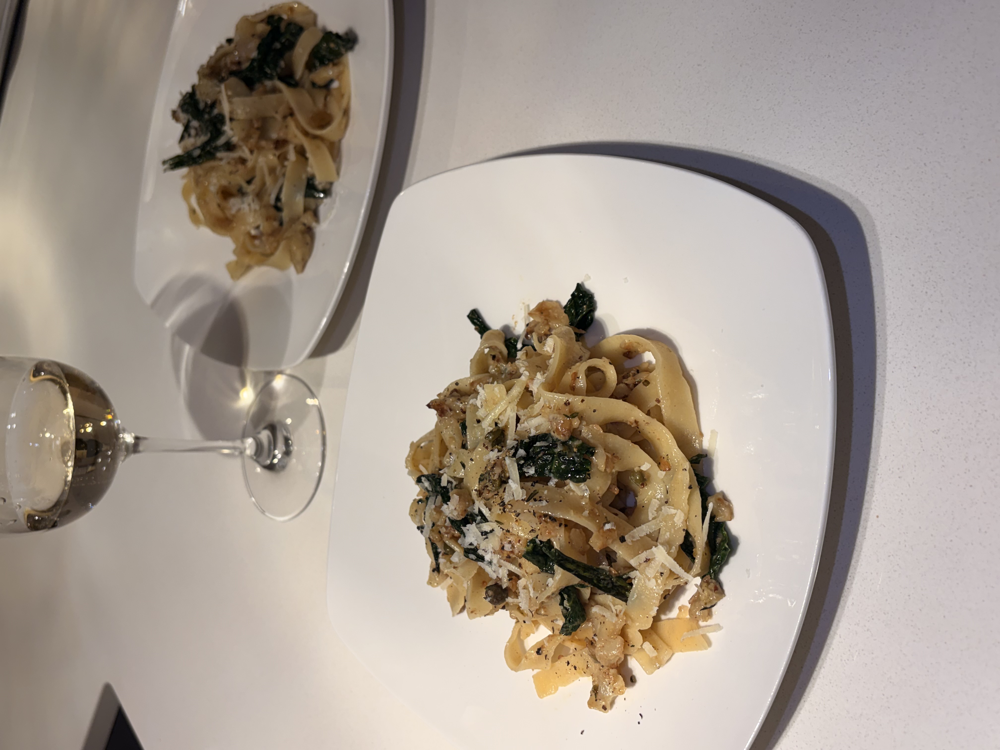

+++
title = "Toasted Cauliflower Kale Pasta"
date = 2025-11-04
description = ""
+++

**Ingredients (4 servings):**

1. 1 head of cualiflower, finely crumbled.
2. 1/2 stick of unsalted butter.
3. 2 cups of shredded kale
4. 2 tbsp capers.
5. 1 lb pasta, preferably a fresh papardelle.
6. 1/2 a shallot.
7. garlic and thyme for taste.
8. 1/2 a lemon.

**Steps:**

1. Melt a quarter stick of butter in the pan until it starts to brown.
2. Add cauliflower and shallot, sautee until they are a crispy brown texture.
3. Add kale, thyme, garlic, and capers, continue to sautee a bit longer, until greens are softened.
4. Add freshly cooked al dente pasta and the remaining butter, along with 1/4-1/2 a cup of pasta water.
5. Finish off with finely shredded parmesan cheese and 1 tbsp of lemon juice
