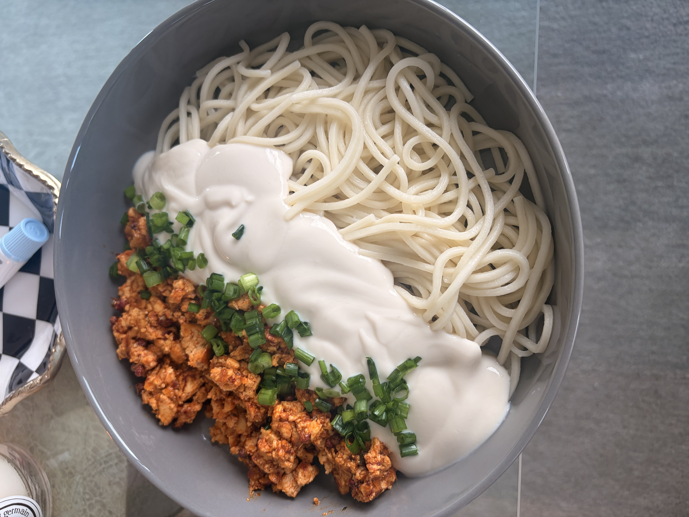

+++
title = "Creamy Tofu Szechuan Noodles"
date = 2025-12-01
description = ""
+++

These noodles were awesome and honestly have never given a try before to blending down tofu to a creamy texture like this before but it was something we 100% will have to try again for some future recipes.

**Ingredients:**

This recipe can be made vegetarian by excluding the grilled chicken and using veggie stock.

1. 1 lb silken tofu.
2. 1 lb medium tofu.
3. 1 lb fresh udon.
4. szechuan peppercorn.

**Steps:**

1. In a food processor, blend the silken tofu down to a creamy texture and set aside.
2. Cook the noodles as per instructions.
3. Crumble the medium tofu, and cook with the peppercorn and salt/pepper and sesame oil.
4. Serve the noodles overlaid with the creamy tofu.
